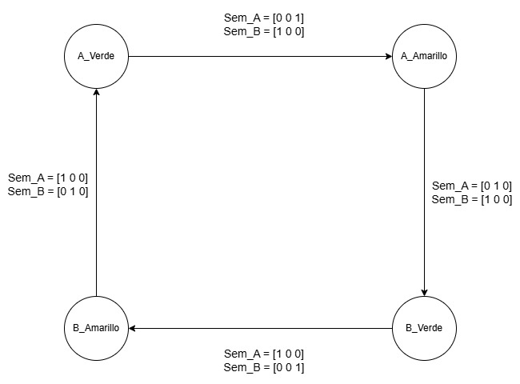

# Control de LEDs y Semáforos con Controllino Mega

Este repositorio contiene el desarrollo de dos prácticas de automatización usando el PLC industrial **Controllino Mega** y el entorno de programación **Arduino IDE**. Ambas prácticas utilizan conceptos clave de sistemas embebidos, como **máquinas de estados finitas (FSM)** y **temporización no bloqueante** con `millis()`.

## Parte 1: Control de matriz de LEDs con botones

### Descripción
Se implementa una secuencia de encendido de 9 LEDs dispuestos en una matriz 3x3. La secuencia puede ejecutarse en orden **espiral normal** o **espiral inverso**, controlada por botones físicos conectados al Controllino. También se dispone de un botón de reinicio que apaga todos los LEDs.

### Características
- Implementación mediante FSM.
- Control mediante 3 botones físicos (espiral normal, espiral inverso, reset).
- Temporización no bloqueante (`millis()`).
- Uso de estructura de datos `struct Led` para manejo de pines.

### Archivos
-  [`Secuencia_botones.ino`](./sec_boton.ino): Código completo con funciones para lectura de botones, control de estados y manejo de LEDs.

---

## Reto: Control de semáforo con FSM

### Descripción
Simulación de un cruce de tráfico controlado por dos semáforos (vertical y horizontal). El sistema alterna entre los semáforos usando una máquina de estados finita que asegura que nunca estén verdes al mismo tiempo.

### Características
- 4 estados: `A_VERDE`, `A_AMARILLO`, `B_VERDE`, `B_AMARILLO`.
- Temporización programada: 5 segundos luz verde, 2 segundos luz amarilla.
- Encapsulación de semáforos mediante estructuras `struct Semaforo`.
- Función auxiliar `setSemaforo()` para modularidad.

### Diagrama de estados

### Archivos
- [`semaforo.ino`](./semaforo.ino): Código completo de la máquina de estados y lógica de temporización.

## Requisitos

- PLC: [Controllino Mega](https://www.controllino.com/)
- IDE: Arduino IDE
- Librería: `Controllino.h` (instalable desde el gestor de librerías)
- Fuente de alimentación de 24V DC
- LED y botones conectados al tablero

---

## Informe

Puedes consultar el desarrollo completo de la práctica, los diagramas, la tabla de asignación de pines y la explicación detallada en:

 [`P4_1_conDig.pdf`](./P4_1_conDig.pdf)

## Autor

E. Bermeo & S. Guillén – Estudiantes de Ingeniería en Telecomunicaciones  
Universidad De Cuenca – Junio 2025

