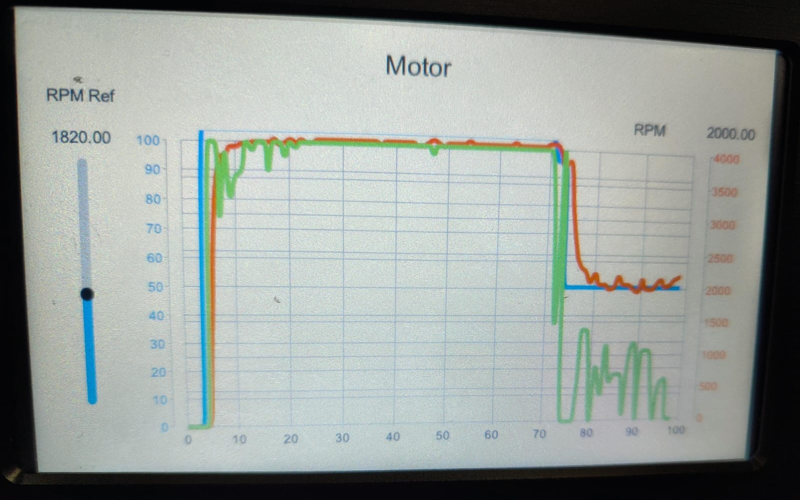

# Práctica 4 – Control de velocidad mediante HMI STONE y Controllino Mega

En esta práctica se implementa un sistema de control de velocidad utilizando una interfaz HMI STONE conectada a un PLC **Controllino Mega**. El usuario regula la intensidad (duty cycle PWM) mediante un slider en la HMI, y el sistema mide y muestra la velocidad actual en revoluciones por minuto (RPM) a través de conteo de pulsos.

---

## Objetivos

- Aplicar control PWM para regular velocidad de un actuador (motor o LED).
- Leer pulsos de un sensor para calcular la velocidad en RPM.
- Mostrar valores en tiempo real en una pantalla HMI STONE.
- Integrar interacción visual con hardware embebido de control industrial.

---

## Componentes utilizados

- Controllino Mega (24 VDC)
- HMI táctil STONE
- Sensor de pulsos o planta con motor DC.
- Actuador: motor o LED de potencia
- Fuente de alimentación externa

---

## Descripción del sistema

- El usuario ajusta un **slider en la HMI** para seleccionar el valor de PWM (0–100%).
- El PLC genera una señal PWM en una salida digital (`CONTROLLINO_D0`).
- Se cuenta el número de pulsos entrantes en una entrada digital (`CONTROLLINO_IN1`) para calcular la velocidad.
- Se aplica un **filtro de media móvil** para suavizar la lectura de RPM.
- Los valores de consigna y lectura actual se actualizan en etiquetas visibles en la HMI.

---

## Ejemplo de respuesta del sistema

Acontinuación se muestra un ejemplo del la respuesta esperada del sistema, una vez implementado en el HMI

## Funcion de transferencia implementada

G(s) ≈ 1.13 / (0.15s + 1)

### Archivos
- [`p4_intento.ino`](./p4_3intento/p4_3intento.ino): Código completo de la máquina de estados y lógica de temporización.
- Adjuntar librerias que se encuentran en la carpeta p4_3intento para concetar arduino con pantalla HMI.

